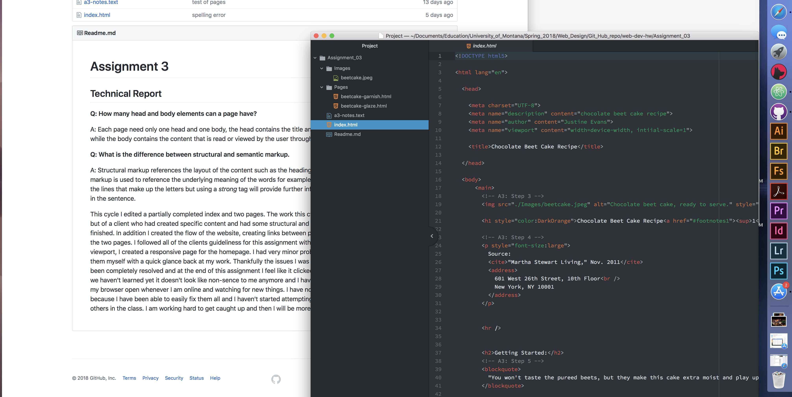

<h1>Assignment 3</h1>
  <h2>Technical Report</h2>

<b>Q: How many head and body elements can a page have?</b>

A: Each page need only one head and one body, the head contains the title
and the meta data that is read by the browser, while the body contains the
content that is read or viewed by the user through an interface.

<b>Q: What is the difference between structural and semantic markup.</b>

A: Structural markup references the layout of the content such as the
headings, line breaks and paragraphs. Semantic markup is used to reference the
underlying meaning of the words for example, using <i>italics</i> tags will change
the slope of the lines that make up the letters but using a <em>strong</em> tag
will provide further information that this word is to be emphasised in the
sentence.

This cycle I edited a partially completed index and two pages. The work this cycle
did not contain content of our choice but of a client who had created specific content
and had some structural and some semantic work that needed to be finished. In addition
I created the flow of the website, creating links between pages and back to the home page
for each of the two pages. I followed all of the clients guideliness for this assignment
with the exception of experimenting with the viewport, I created a responsive page for the homepage.
I had very minor problems and was able to easily troubleshoot them myself with a quick
glance back at my work. Thankfully the issues I was having in the begining of the course
have been completely resolved and at the end of this assignment I feel like it clicked
into place for me, when i look at code that we haven't learned yet it doesn't look
like non-sence to me anymore and I have been keeping the web inspector option on my
browser open whenever I am online and watching for new things.
I have not posted to the class repo for my own issues because I have been able to
easily fix them all.

