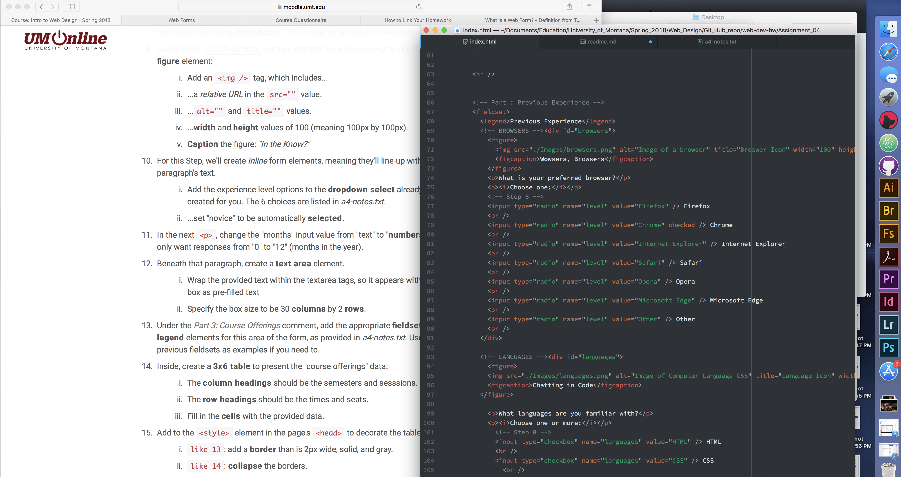

<h1>Assignment 4</h1>
  <h2>Technical Report</h2>

<b>Q: What is alt text and why do we use it?</b>

A: Alternate text is used to provide a desctiption of an image to
a browser in order to display as an alternative in the case the
image fails to load or can not be seen (in the case of a screen reader)
and is also used by search engines to identify images. The alt tag is used to increase accessibiltiy, to ensure the message of the image is
recieved by those who can't see it and also to assist a search engine to find your images and make sure your content is found.

<b>Q: What types of forms have you come across on the web and what
purpose did they serve?</b>

A: I use forms everyday, multiple times a day...search engines are the most common that I use,
form elements are everywhere log-ins, submissions, posting are important to the online classes i take.

This cycle I added content to tables, filling in rows and columns, creating a simple border and various form elements such as radio buttons, drop down choices, required fields (usernames and passwords) and open
text options. I had many small issues that were not as intuitive to solve than the problems I had in the last project, a bit of trial and error and looking for different ways to tag items helped solve any issues
I had. I was creating a form based on an imaginary client's needs and requests and followed them for the
most part although the alignment of the center area bothered me and I was wishing I could change it. I wanted to select an alternative Media Arts Logo, one with clear lines and copy included and I debated with
myself if I should deviate from the client requests given, I decided if this were a real client situation I could offer an alternative with the option to revise to original requests if needed.

