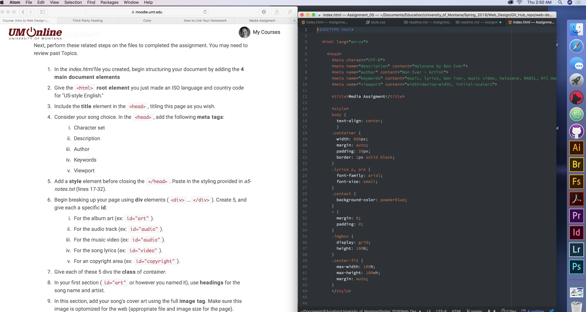

<h1>Assignment 5</h1>
  <h2>Technical Report</h2>

<b>Q: What is the difference between divs, classes, ids and spans?</b>

A: Div elements group other elements together, this grouping allows for
better organization but also allows for CSS styling to be applied
to different sections of your content. The Class attribute is an identifier
and selector value for HTML elements, this groups similar types of elements
together by giving them the same name. The ID or global attribute provides
a value that distinguishes the element attached to it from the other elements.
While ID, class and divs all help to organize content and allow you to
create unique styling in CSS, they each provide a different level of specificity
to the elements you use them with from the very specific ID to the class grouping
and the div which groups many elements together. The span element is very similar to
the div element but it does NOT create divisions of content, multiple spans can be
used within a div in order to make very specific distinguishing styling to content
within divs.

<b>Q: Why would one consider third-party hosted media over self-hosted?</b>

A: A third-part content host will handle compatibility and encoding which allows
a simple option to add high quality media to your site without the hassle of
being responsible for all the details of self-hosting.

This cycle I really enjoyed creating this site for a song and artist details. I used
the requested images and third party hosted audio and video but also added an
additional image that compliments the album art. I wanted this large image to span
the top of the page and adjust to different browser sizes, so i looked up some code to
create a responsive image that would stretch the image as needed. I found some on a
sharing site and it was a perfect illustratoin of why contributing to sites with
whatever knowledge you have is important part of design and made me want to
contribute any small thing to the class resource page even if it doesnt seem like
a large contribution.  
The code took over the content that followed it and my image across the top that
changes with different screen sizes also removed the border on the rest of the divs somehow.

