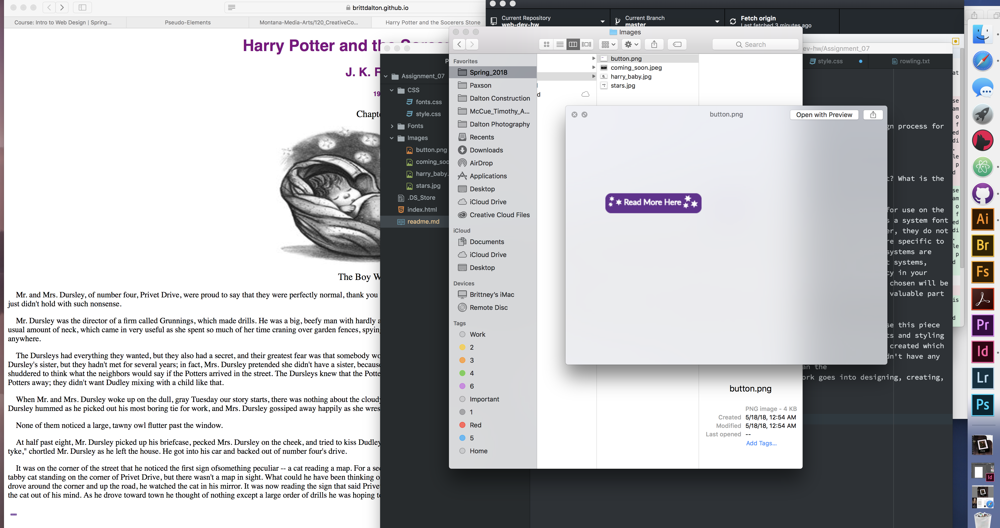

<h1>Assignment 7</h1>
  <h2>Technical Report</h2>

<b>Q: What font did you choose for this assignment, briefly describe your design process for the project.</b>

A:

<b>Q: What is the difference between a system font, web font, and web-safe font? What is the importance of having fallback fonts or a font stack? </b>

A: System fonts are installed on a local device/system, they are not designed for use on the web and must be exported as images , although they can be used by most programs a system font is best used for things intended to be printed. Web fonts are hosted on a server, they do not have to be saved to a user's device. Web fonts are optimised for the web but are specific to different operating systems. Web fonts that can be used by multiple operating systems are called web-safe fonts, using web-safe fonts will display correctly on different systems, reduce load times and may increase performance. Fallback fonts create redundency in your coding, in the event a font is not available to a user than the fallback fonts chosen will be used until a font that can display properly is found for the user, making it a valuable part of creating reliablility and accessabilty.

This cycle I created a website with an excerpt from Harry Potter book 1, I chose this piece
because I loved the book when I was younger so I had a lot of fun choosing fonts and styling
the site with references from the book such as the three stars on the button I created which are the same as the three stars on the corners of the pages in the books. I didn't have any major issues, I felt this page was much easier to style than the last one. I did spend a lot of time creating a custom png of a button and then didn't know how to alter it with pseudos like hover so I changed it to a simple button like the example given. I loved learning about typography and how much work goes into designing, creating,
linking and using fonts.

