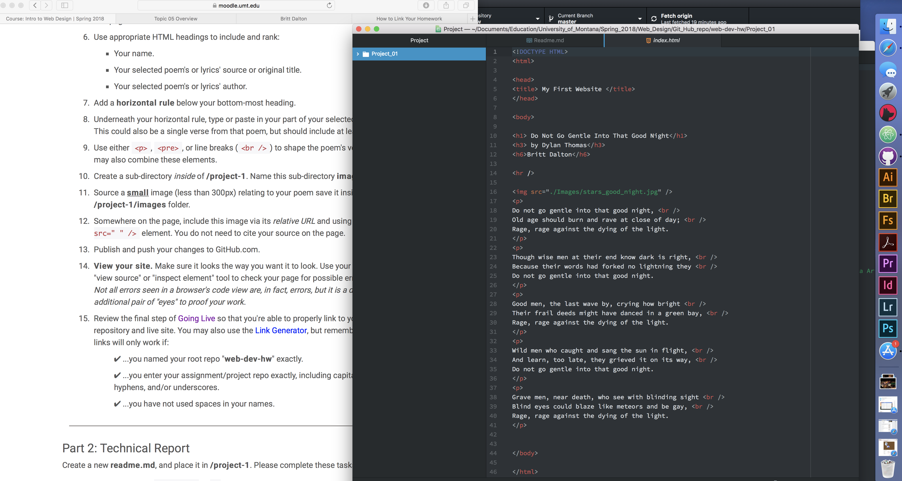

<h1>Project 1</h1>
<h2>Technical Report</h2>

<b>Q: How does a browser funtion and which browsers do you use?</b>

A: A browser is a software program that allows users to access the internet.
I use Safari on my personal devices and computer, right now it is the only browser
I use.

<b>Q: Which site did you visit on the Wayback Machine?</b>

A: I viewed the screenshot for The New York Times from Monday, January 25, 1999.
The page looks nothing like it does today but doesn't look as old as I expected
it to. The logo is still the same style, written across the top of the page, the
menu options were in a table on the left that looks very simple. The layout is
still similar to today with verticle blocks of articles with small pictures.

This cycle I created html files to publish and updated my GitHub website in order
to make that easier. It was slow going, it took me a long time but I understood what
I was doing and was able to go back and work out any mistakes I made along the way.

